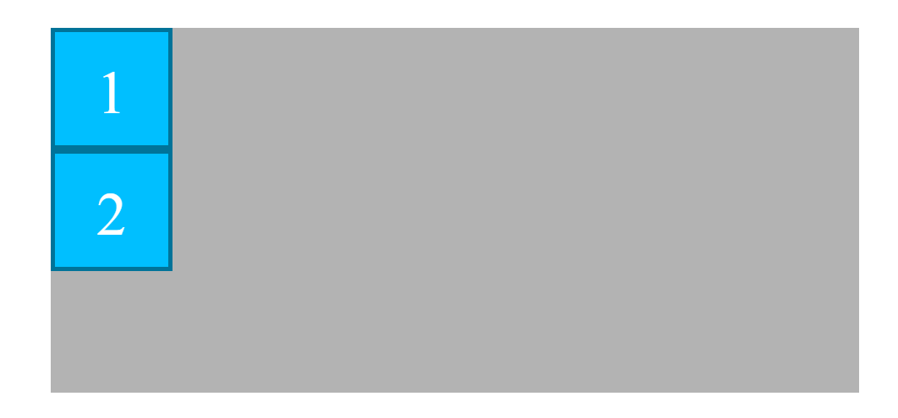
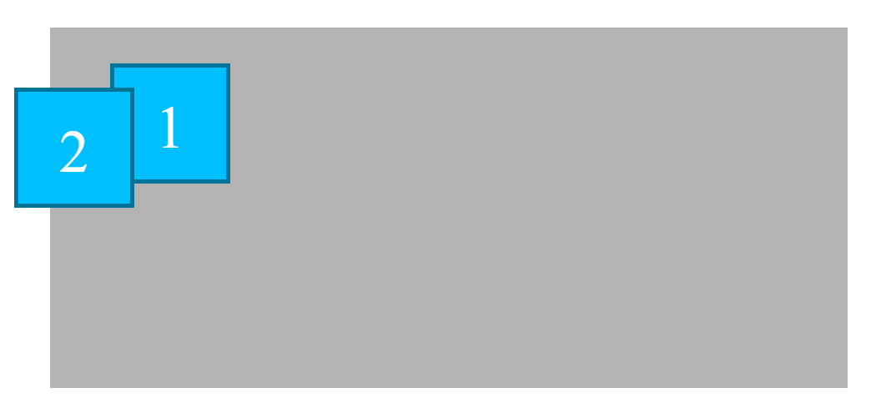
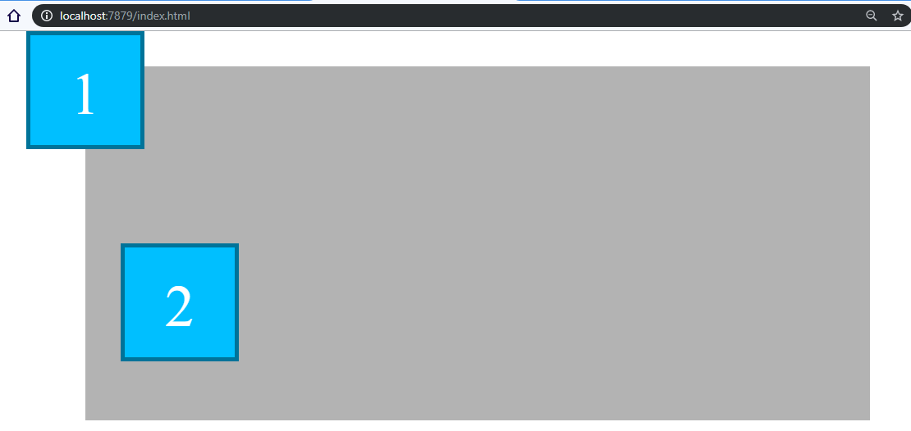

# Ejemplo de la propiedad **position: relative**
En el ejemplo se pueden ver una caja principal/padre (.padre) con dos cajas hijas en su interior (.hijo), como se observa en la imagen 
```html
<div class="padre">
    <div id="hijo1" class="hijo">1</div>
    <div id="hijo2" class="hijo">2</div>
</div>
```
```scss
.padre {
    height: 30rem;
    width: 70%;
    margin: 3rem auto 0;
    background-color: lighten(gray, 20%);
}

.hijo {
    height: 10rem;
    width: 10rem;
    background-color: deepskyblue;
    color: white;
    text-align: center;
    line-height: 10rem; // Técnica de centrado vertical (solo una línea)
    font-size: 5rem; 
    border: 5px solid darken(deepskyblue, 20%);
}
```
- En el paso 01 al establecer la propiedad **position** de las cajas "hijas" a **relative** su posición no se modifica, esto es así porque la propiedad positión si no se establecen las "coordenadas" (top, left, ...), el elemento se sitúa en la posición que normalmente tendría con el flujo normal del html
```scss
.hijo {
    /* 
     * No sucede nada puesto que position: relative, deja a los elementos en su posición original
     */
    position: relative; 
}
```

- En el paso 02 al establecer las propiedades top, left, right, bottom, a ambas cajas hijas, los elementos se mueven desde su posición original en los valores establecidos

```scss
#hijo1 {
    // Se desplaza desde donde estaba originalmente 3 rem hacia abajo
    // Se produce un solapamiento ya que el hijo2 respeta la posición de hijo1 original
    top: 3rem; 
    // Se desplaza desde su posición original a la izquierda 5rem hacia la derecha
    left: 5rem; 
}

#hijo2 {
    // Se vuelven a alinear
    // top: 3rem; left: 5rem;
    // Se desplaza desde su posición original a la derecha hacia la izquierda
    right: 3rem;  
    // Se desplaza desde su posición original abajo hacia arriba
    bottom: 5rem; 
}
```

- Finalmente en el paso 03, se vuelven a establcer valores diferentes para las propiedades top, left, right, bottom, pero con margenes negativos, se puede observar, que la propiedad **right: -3rem** es equivalente a **left: 3rem**

```scss
#hijo1 {
    // Se desplaza desde donde estaba originalmente 3rem hacia arriba
    top: -3rem; 
    // Se desplaza desde su posición original a la izquierda 5rem hacia la izquierda
    left: -5rem; 
}

#hijo2 {
    // Se desplaza desde su posición original a la derecha hacia la derecha 
    right: -3rem; 
    // Se desplaza desde su posición original abajo hacia abajo 
    bottom: -5rem; 
}
```


