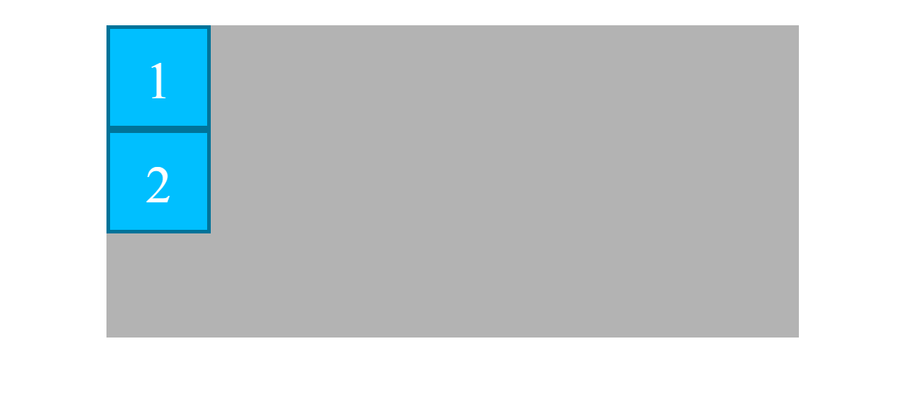
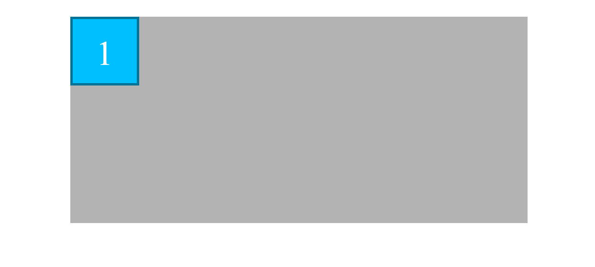
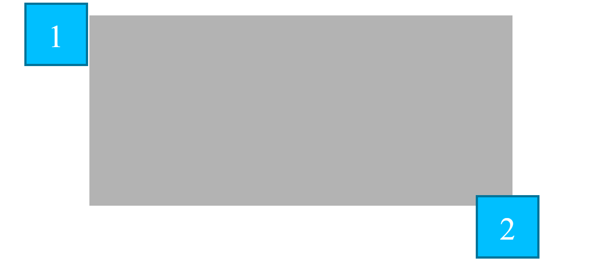

# Ejemplo de la propiedad **position: absolute**. Parte I
En el ejemplo se pueden ver una caja principal/padre (.padre) con dos cajas hijas en su interior (.hijo), como se observa en la imagen 
```html
<div class="padre">
    <div id="hijo1" class="hijo">1</div>
    <div id="hijo2" class="hijo">2</div>
</div>
```
Y el css correspondiente: 
```scss
.padre {
    height: 30rem;
    width: 70%;
    margin: 3rem auto 0;
    background-color: lighten(gray, 20%);
}

.hijo {
    height: 10rem;
    width: 10rem;
    background-color: deepskyblue;
    color: white;
    text-align: center;
    line-height: 10rem; // Técnica de centrado vertical (solo una línea)
    font-size: 5rem; 
    border: 5px solid darken(deepskyblue, 20%);
}
```

- En el paso 01 se establece la propiedad **position: absolute**, como consecuencia la caja número 1 desaparece y solo se ve la caja número 2, esto es porque la caja número 1 se sitúa por detrás de la caja número 2, ambos elementos se sitúan en en lugar que les corresponde en el flujo normal del html, que es el mismo ya que ambos elementos no se tienen en cuenta el uno al otro, la propiedad **position: absolute** los saca del flujo
Es posible intercambiar la profundidad de ambos alementos mediate la propiedad **z-index** vista más adelante

```scss
.hijo {
    // El elemento se sale del flujo y se situa en su posición natural si tuviera propiedad static a no ser que le establezca top, left, ...
    position: absolute; 
}
```

- En el paso 02 se establece valor a las propiedades top, left, right, bottom, a ambas cajas hijas, y como se puede ver las coordenadas establecidas son respecto a la coordenada superior izquierda del **html**,ya que en el ejemplo es el **primer ancestro con la propiedad position establecida**

```scss
#hijo1 {
    // Respecto de la coordenada (0, 0) del primer ancestro con position establecido
    top: 1rem; 
    // Respecto de la coordenada (0, 0) del primer ancestro con position establecido
    left: 4rem; 
}

#hijo2 {
    // Respecto de la coordenada inferior del primer ancestro con position establecida
    bottom: 5rem; 
    // Respecto de la coordenada derecha del primer ancestor con position establecida
    right: 10rem; 
}
```

