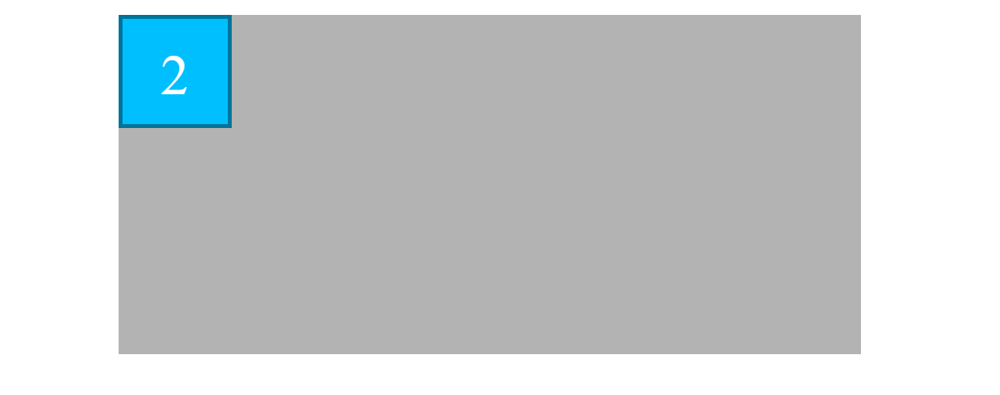
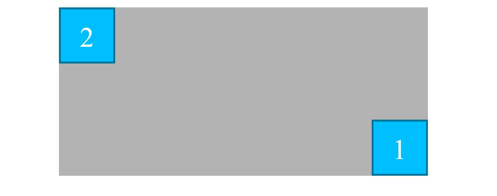
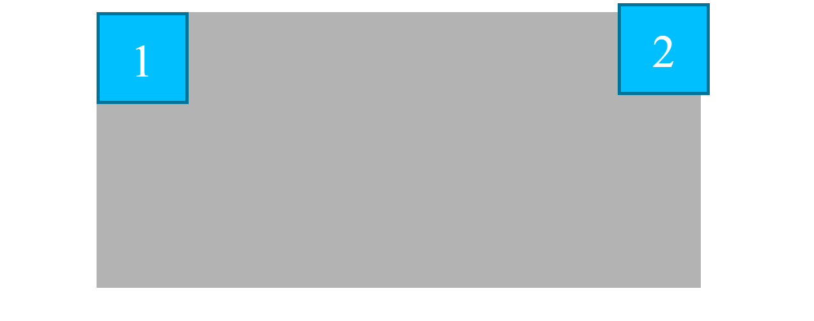

# Ejemplo de la propiedad **position: absolute**. Parte II
En el ejemplo se pueden ver una caja principal/padre (.padre) con dos cajas hijas en su interior (.hijo), como se observa en la imagen 
A diferencia del ejemplo anterior, se establece al padre **position: relative**, de forma que se convierta en el primer ancestro, de sus hijos (que tienen establecido **position: absolute**), que tiene la propiedad **position** establecida (diferente de static).
De esta forma conseguimos que los elementos hijos, se posicionen respecto del padre y no respecto de la ventana, y además el padre se mantiene en su posición original ya que no le establecemos coordenadas


```html
<div class="padre">
    <div id="hijo1" class="hijo">1</div>
    <div id="hijo2" class="hijo">2</div>
</div>
```
Y el css correspondiente: 
```scss
.padre {
    height: 30rem;
    width: 70%;
    margin: 3rem auto 0;
    background-color: lighten(gray, 20%);
    position: relative; // Ancestro con position: establecido, que no se mueve
}

.hijo {
    height: 10rem;
    width: 10rem;
    background-color: deepskyblue;
    color: white;
    text-align: center;
    line-height: 10rem; // Técnica de centrado vertical (solo una línea)
    font-size: 5rem; 
    border: 5px solid darken(deepskyblue, 20%);
    position: absolute;
}
```

- En le **PASO 01** situamos al elemento "#hijo1" en la parte inferior derecha, pero como decíamos anteriormente será la parte inferior derecha del elemento ".padre" ya que es el primer ancestro que tiene la **propiedad position establecida**

```scss
#hijo1 {
    // Respecto del primer ancestro con position establecido
    bottom: 0; // Abajo
    right: 0; // A la derecha
}
```

- En le **PASO 02** situamos al elemento "#hijo1" en el centro del elemento ".padre", para ello utilizamos una técnica de centrado, consistente en establecer su top y right al 50% y restar la mitad de su ancho y alto mediante márgenes negativos

```scss
#hijo1 {
    // position: absolute;
    right: 50%;
    top: 50%;
    margin-right: -5rem;
    margin-top: -5rem;
}
```

- Finalmente en el paso **PASO 03**, situamos al elemento "#hijo2" en el borde superor derecho pero saliendose un poco de su padre, mediante margentes negativos

```scss
#hijo2 {
    // position: absolute;
    top: -1rem;
    right: -1rem;
}
```