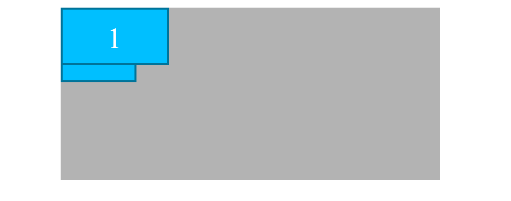

# Anchos relativos en posicionamiento absoluto
En el ejemplo se pueden ver una caja principal/padre (.padre) con dos cajas hijas en su interior (.hijo).
```html
<div class="padre">
    <div id="hijo1" class="hijo">1</div>
    <div id="hijo2" class="hijo">2</div>
</div>
```

Ambas cajas hijas tienen el mismo ancho proporcional del 20%
```scss
.hijo {
    height: 10rem;
    width: 20%; // Ancho proporcional
    background-color: deepskyblue;
    color: white;
    text-align: center;
    line-height: 10rem; // Técnica de centrado vertical
    font-size: 5rem; 
    border: 5px solid darken(deepskyblue, 20%);
}
```
Sin embargo, ambas cajas tienen un ancho diferente, como se aprecia en la imagen

Esto se debe a que ambas cajas tienen establecidas propiedades **position** diferentes:
- **absolute**. Con lo cual el 20% de ancho se calcula respecto del primer ancestro con position establecido, en este caso el html
- **relative**. Con lo cual el 20% de ancho se calcula respecto de su padre
```scss
#hijo1 {
    // El ancho cambia ya que es un 20% respecto del primer ancestro con position establecido en este caso el html
    position: absolute; 
    z-index: 1;
}
#hijo2 {
    // El ancho cambia ya que es un 20% respecto a su padre en este caso ".padre"
    position: relative;
    top: 3rem;
}
```