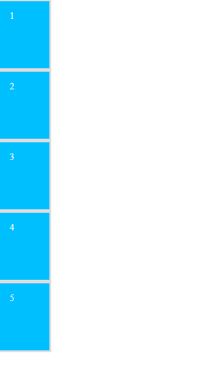

# Ejemplo con la propiedad z-index

En el ejemplo se parten de 5 elementos en bloque, todos ellos con la clase ".card" con forma de naipe con un número en su interior

```html
<body>
    <div class="card">1</div>
    <div class="card">2</div>
    <div class="card">3</div>
    <div class="card">4</div>
    <div class="card">5</div>
</body>
```

```scss
.card {
    height: 20rem;
    width: 15rem;
    background-color: deepskyblue;
    border: 10px solid #DDD;
    color: white;
    font-size: 3em;
    padding: 1em;
}
```



Lo que se pretende es mostrar cada uno de los ".card" en forma de naipe, para ello es necesario modificar la posición de las ".card" 2, 3, 4, 5 ya que la primera esta en su posición correcta
Esto lo realizamos mediante un **bucle each** desde 2 hasta 5, y aplicando estilos a cada uno de estos elementos

```scss
@for $i from 2 through 5 {
    .card:nth-child(#{$i}) {
        ...
    }
}
```

En el interior de cada selector css establecemos su propiedad position en función del iterador, haciedo que se desplacen los ".card" hacia abajo y a la derecha (top, left)

```scss
@for $i from 2 through 5 {
    .card:nth-child(#{$i}) {
        position: absolute;
        left: 8rem * ($i - 1);
        top: 5rem * ($i - 1);
        ...
    }
}
```

Finalmente establecemos su propiedad **z-index: 1**, a uno de los elementos en función de una constante, esto hace que la propiedad **z-index** del elemento seleccionado sea superior al del resto y se vea superpuesto en el eje z

```scss
@for $i from 2 through 5 {
    .card:nth-child(#{$i}) {
        position: absolute;
        left: 8rem * ($i - 1);
        top: 5rem * ($i - 1);
        @if ($i == 2) {
            z-index: 1;
        }
    }
}
```


## Z-INDEX

- La propiedad **z-index** determina el nivel de pila de un elemento HTML. El "nivel de pila" se refiere a la posición del element en el eje Z
- Solo es valida esta propiedad con la propiedad **position** establecida, si es necesario puedo poner **position: relative** sin establecerle coordenadas ya que el elemento se queda en su sitio
