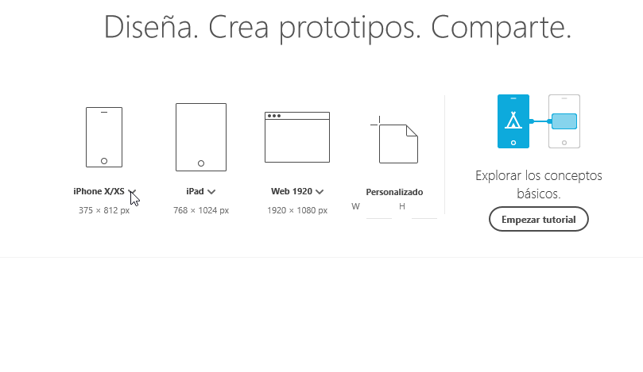
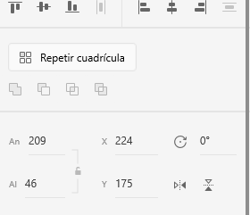
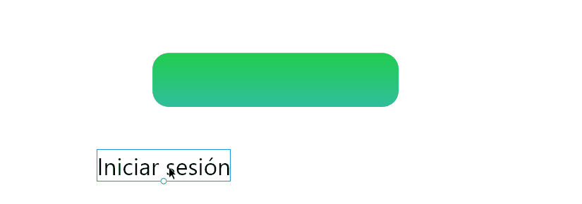
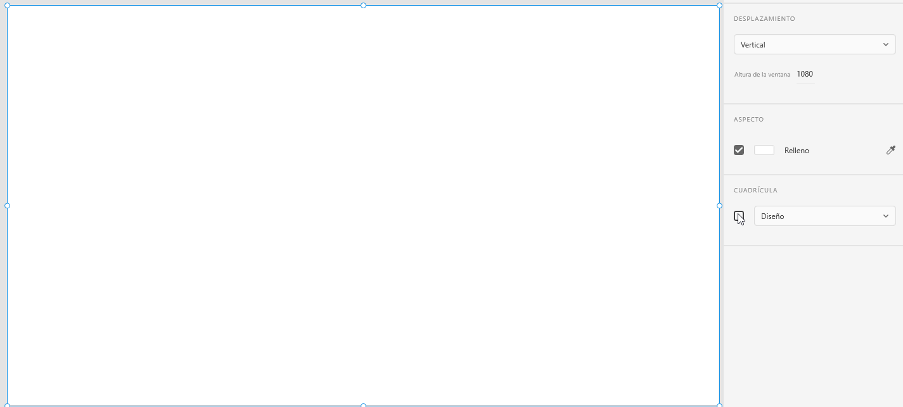
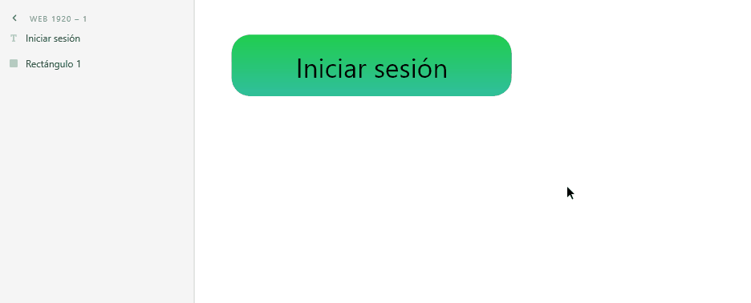
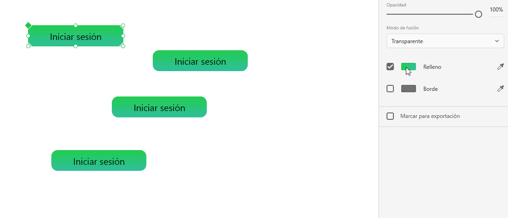
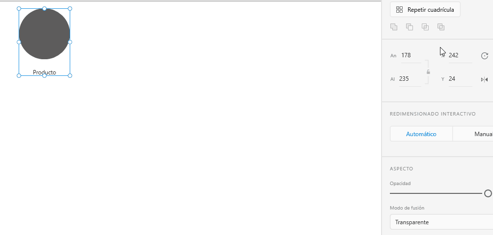
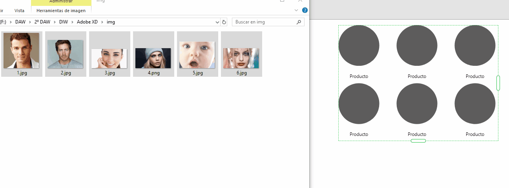
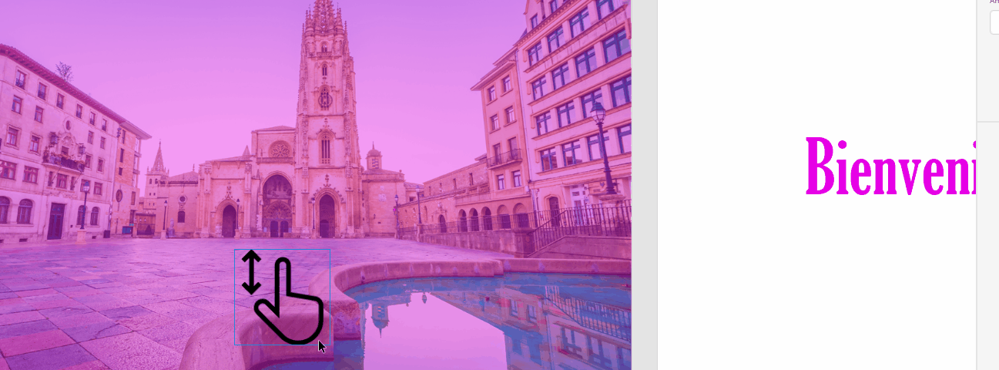

# ADOBE XD

## Contenido

1. ¿Qué es Adobe XD?
2. ¿En qué casos querríamos utilizar Adobe XD?
3. ¿Qué podemos hacer con Adobe XD?
4. Proyecto de ejemplo

### 1. ¿Qué es Adobe XD?

Es un editor de gráficos vectoriales cuyo principal uso es diseñar y construir un prototipo de la experiencia del usuario en páginas web y aplicaciones móviles. Dispone de una versión gratuita en [su página oficinal](https://www.adobe.com/es/products/xd.html).

### 2. ¿En qué casos querríamos utilizar Adobe XD?

En una herramienta realmente interesante tanto para diseñadores como programadores web a la hora de poder realizar prototipos para enseñar al cliente, maquetar nuestra idea de la web que queremos o simplemente probar como funcionan juntos los diferentes elementos sin falta de programar nada.

### 3. ¿Qué podemos hacer con Adobe XD?

#### Diseñar nuestro proyecto pensando en el dispositivo

Podemos seleccionar diferentes plantillas con las resoluciones de algunos dispositivos muy comunes, además, si fuera necesario podemos crear un espacio de trabajo medidas personalizadas.

#### Trabajar con 4 formás básicas únicamente

Con tan sólo un rectángulo, una elipse, un triangulo y una linea podemos contruir cualquier elemento que se nos ocurra.

Por supuesto, podemos también podemos construir formas simétricas y modificarlas.

#### Modificar cada elemento en su propio panel

Cada elemento al seleccionarlo despliega en la derecha de la pantalla un panel con multitud de opciones para personalizar y lograr que tenga la apariencia deseada.

#### Utilizar las guías flexibles

A la hora de colocar elementos, podemos hacer uso de las guías dinámicas que el propio programa nos proporciona en base al resto de elementos que rodean el nuestro.

#### O crear nuestras propias guías

Podemos crear nuestras propias guías en base a unos parámetros que introduzcamos (número de columnas, distancia entre ellas, anchura de la columna...)

#### Agrupar los elementos y crear componentes

Seleccionando más de un elemento, podemos agruparlos en carpetas.

Y convertirlos en componentes reutilizables.

Por supuesto, al modificar el estilo de los elementos originales, se modifican todos los componentes reutilizados.

#### Clonar elementos en forma de cuadrícula

Podemos clonar los elementos hacia los lados para realizar de forma rápida cuadrículas con ellos, también es posible modificar el espacio horizontal y vertical entre ellos.

Además, si disponemos de varias imagenes, podemos arrastrar todas a la vez para que se coloquen en el elemento deseado.

#### Añadir animaciones entre ventanas

Una vez realizado todo el diseño de las distintas ventanas, podemos acceder a la pestaña de Prototipo para dinamizar nuestro proyecto de una manera similar a la deseada.

#### Visualizar el prototipo

Con todo, para presentarse de una forma más amigable nuestro proyecto puede iniciar una presentación interactiva en base a todas las animaciones y ventanas que diseñemos.

### 4. Proyecto de ejemplo

Puedes descargar desde este mismo repositorio un [prototipo de ejemplo](./Proyecto-ejemplo/) donde están implementadas algunas de las funciones que hemos detallado.